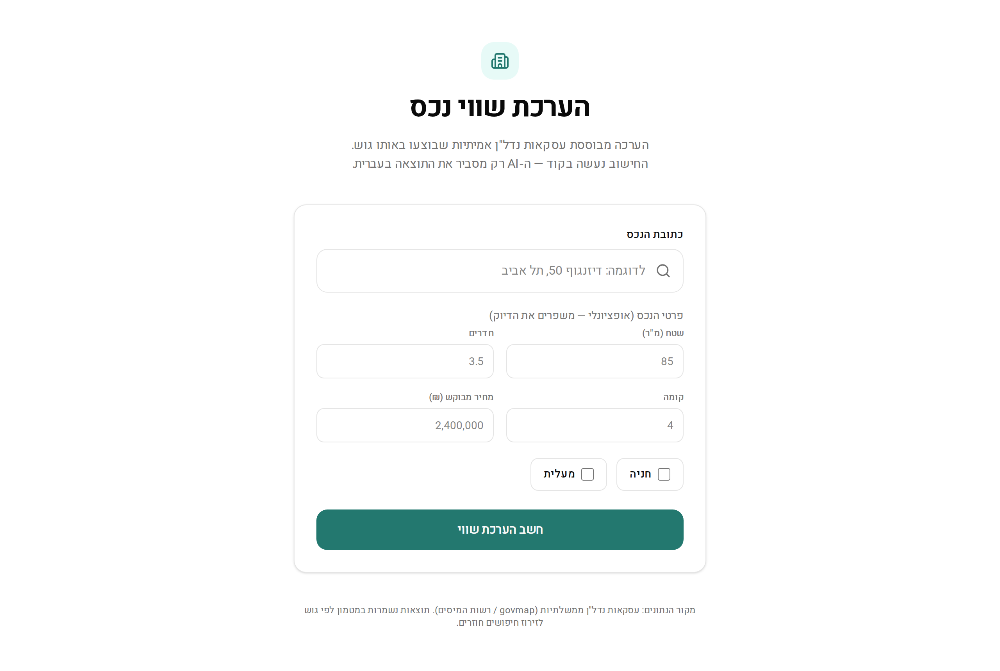
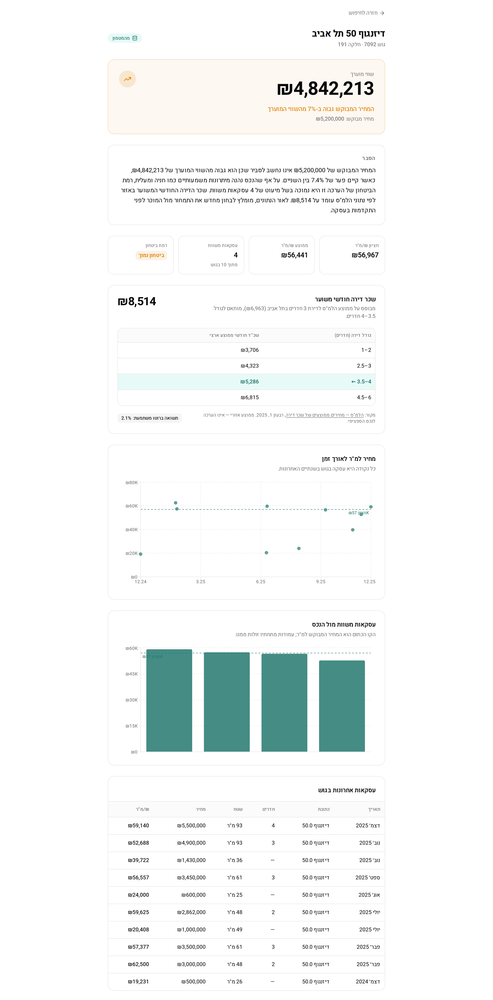
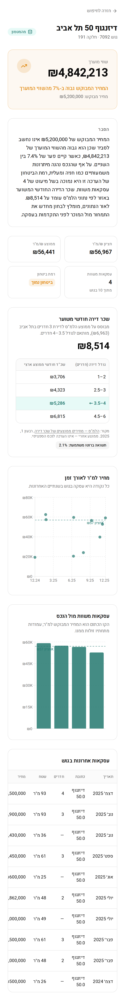

# Israeli Real-Estate Valuation

Type an Israeli address and get a **sale valuation** and an **estimated monthly
rent** — each grounded in real government data, computed in code, and explained in
plain Hebrew. Built with Next.js (App Router), TypeScript, Tailwind v4, Neon
Postgres, and Gemini.

**Live demo:** https://israeli-rental-property-pricing-prediction-k9rnf0e1t.vercel.app



> **The principle the whole app is built around:** code does all the *numbers*; the
> LLM does only the *words*. Every figure on screen is computed deterministically
> in `lib/`. Gemini receives the finished numbers and is forbidden from doing
> arithmetic — it only writes the human explanation.

---

## The report

One address produces an estimated value with a fair / over- / under-priced verdict,
a CBS-based monthly rent, ₪/m² charts, the comparable deals the numbers came from,
and a Hebrew explanation that cites those exact figures — plus graceful states for
*no match*, *ambiguous address*, *no data*, and *service outage*.

<table>
<tr>
<td width="62%"></td>
<td width="38%"></td>
</tr>
</table>

---

## How it works

```
address
  → geocode        govmap autocomplete → point (EPSG:3857) + parsed address
  → resolve block  govmap deals-by-radius → building polygon
  → deals          govmap street-deals (the nadlan sale dataset) → raw rows
  → clean          drop typos/dupes, compute ₪/m², parse dates, stable-hash dedupe
  → fridge         Neon, cache-first  (the block/gush is read from the deal rows)
  → stats          lib/stats — median/mean ₪/m², comparables, value, delta   (deterministic)
  → rent           lib/rent — CBS area-average rent by city × size            (deterministic)
  → narrative      Gemini Flash-Lite — explains the numbers in Hebrew         (no math)
  → report         Server Component renders it (no internal HTTP hop)
```

Three layers, kept strictly separate:

- **UI** — `app/` routes; the input form is the only client component, everything else is a Server Component.
- **Compute** — `lib/stats` (sale valuation) and `lib/rent` (rent), both pure and deterministic, plus `lib/ai` (narrative).
- **Data** — `lib/geo` + `lib/deals` (government sources) behind `lib/cache` + `lib/db` (the Neon "fridge").

---

## Notable engineering decisions

**A hard boundary between math and language.** Valuation numbers are produced only
in `lib/stats`/`lib/rent`. The Gemini prompt is given pre-formatted numbers and a
strict "copy them verbatim, never calculate" instruction at temperature 0; the UI
renders the code-computed figures, not anything the model emits. This keeps the
output trustworthy and the model's job narrow.

**Cache-first against slow, unofficial endpoints.** The government APIs are
reverse-engineered, rate-limited, and occasionally break. Everything is cached in
Neon and served cache-first, so a repeat search makes **zero government calls and
zero LLM calls**. Three tiers, each with the right invalidation strategy:

| Cache | Holds | Freshness |
|---|---|---|
| `deals` + `gush_sync` | cleaned sale deals per block | refetched after **7 days** |
| `geo_cache` | address → point / polygon / gush / city | 180 days (the mapping is permanent) |
| `ai_summary` | the Gemini narrative | **content-addressed** — keyed by a hash of the numbers |

The narrative cache *cannot* go stale: its key is a hash of the exact numbers it
describes, so when deals refresh and the numbers change, the key changes and a
fresh explanation is generated automatically.

**Resilience built in.** A single throttled+retrying gateway (`lib/gov/http`)
fronts every government call. govmap's point→gush endpoint is dead, so the block is
derived from the deal rows themselves (which carry `gushNum`/`parcelNum`). On an
outage, the fridge serves stale-but-useful data; raw provider errors never reach the
UI — every outcome is a typed state.

**Honest data sourcing.** Israel has no per-property rent registry (the Tax
Authority records sales, not rent), so rent uses **Central Bureau of Statistics**
area averages — by city for a 3-room flat, scaled to the subject's size — and the
page shows the source, period, and a "this is an area average" caveat. Nothing is
presented as more precise than it is.

**Type-safe boundaries.** Every external response (government + AI) is validated
with Zod at the boundary; untyped JSON never flows inward. The deterministic
valuation math has its own assertion-based self-check.

**Measured, not guessed.** The only marginal cost per query is the Gemini
narrative: ~388 in + ~231 out tokens on Flash-Lite ≈ **$0.00013** (about one
hundredth of a cent), and ~$0 on a repeat. Verified against the real API, not
estimated.

---

## Tech stack

| | |
|---|---|
| Framework | Next.js 16 (App Router, Server Components) · React 19 |
| Language | TypeScript (strict) |
| Styling | Tailwind CSS v4 (CSS-first) · RTL Hebrew · Recharts |
| Data / cache | Neon Postgres + Drizzle ORM (our cache only) |
| Validation | Zod (shared client + server) |
| AI | Google Gemini (`@google/genai`), Flash-Lite — narrative only |
| Sources | govmap + nadlan (sale deals) · CBS (rent) — all unofficial/public |
| Hosting | Vercel (Node runtime) + Neon |

Pinned versions in [`STACK.md`](./STACK.md); architecture and rules in
[`ARCHITECTURE.md`](./ARCHITECTURE.md); endpoint details and caveats in
[`docs/data-sources.md`](./docs/data-sources.md).

---

## Getting started

```bash
cp .env.example .env.local    # DATABASE_URL (Neon) + GEMINI_API_KEY (Google AI Studio)
pnpm install
pnpm db:push                  # create the fridge tables
pnpm dev                      # http://localhost:3000
```

Optional env: `GEMINI_MODEL` (default `gemini-flash-lite-latest`), `GOVMAP_BASE_URL`.

| Command | Does |
|---|---|
| `pnpm dev` / `build` / `start` | dev server / production build / serve |
| `pnpm lint` · `pnpm typecheck` | ESLint (flat config) · strict TS |
| `pnpm db:generate` · `pnpm db:push` | generate a migration · apply schema to Neon |

Deploy to Vercel (set `DATABASE_URL` + `GEMINI_API_KEY` for Production + Preview):

```bash
vercel deploy --prod --token "$VERCEL_TOKEN" -y
```

---

## Project structure

```
app/
  page.tsx                 home — address + property form
  report/page.tsx          report — Server Component, calls the orchestrator directly
components/
  valuation-form.tsx       the only client component
  charts/                  Recharts trend + comparables (client-side)
lib/
  geo/         govmap geocoding (autocomplete → point + address)
  deals/       govmap street-deals adapter + cleaning
  gov/http.ts  shared throttle + retry for every government call
  cache/       cache-first fridge (deals · geo · AI summary) — the only writer of deals
  stats/       computeStats — deterministic sale valuation
  rent/        CBS area-average rent — deterministic
  ai/          Gemini narrative (explains numbers; cached; never computes)
  valuate.ts   orchestrator: address → typed report
  db/          Drizzle schema + Neon connection
types/property.ts          Zod domain types
drizzle/                   generated SQL migrations (committed)
```

Hard rules enforced throughout: server-only data/AI layer · Zod at every external
boundary · the LLM never produces a number · Drizzle for our Neon cache only ·
RTL/Hebrew logical CSS properties only · pnpm only.
